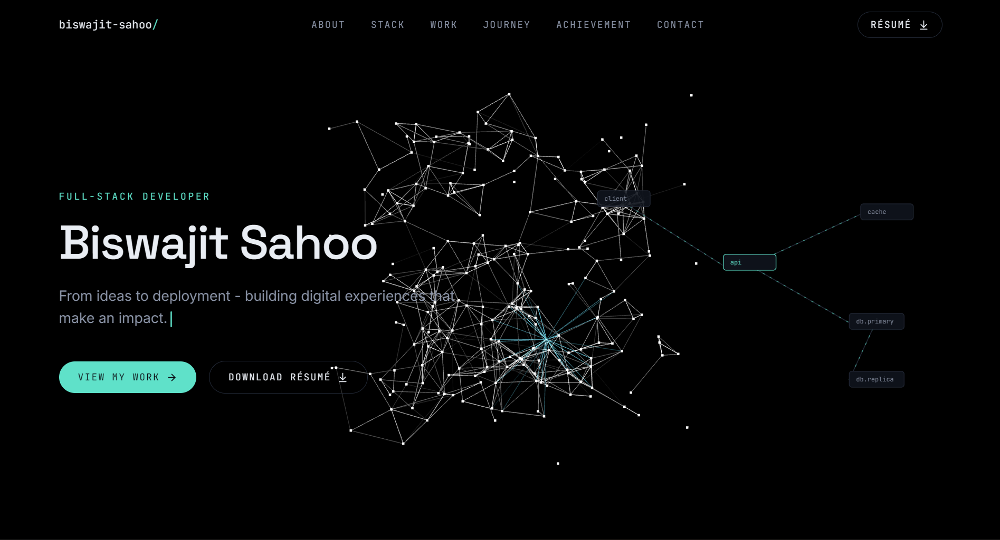
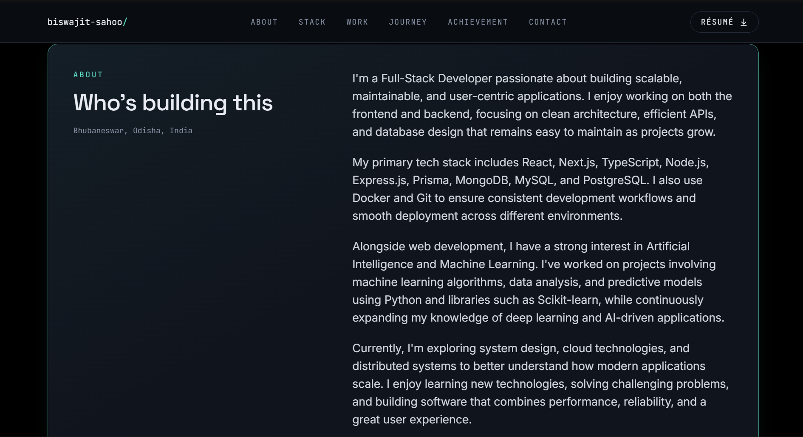
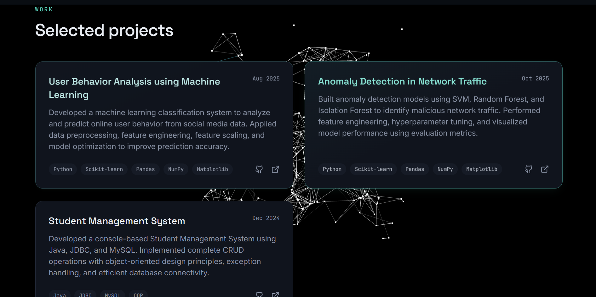
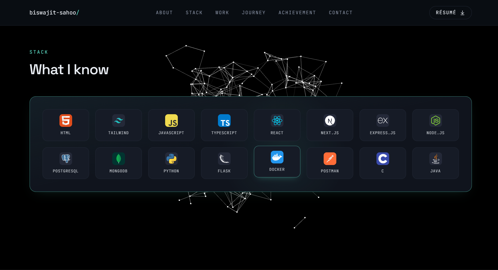
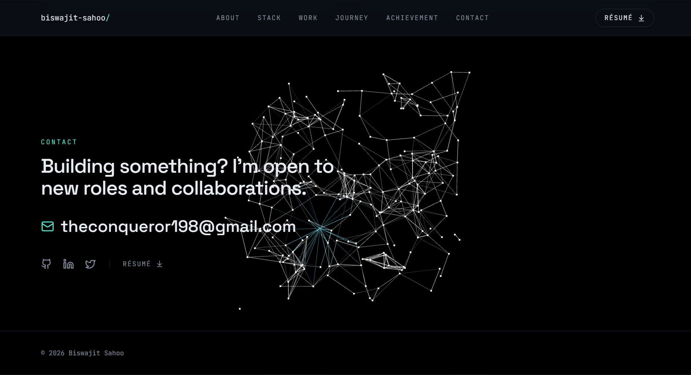

# 🌐 Biswajit Sahoo - Portfolio

> **"I build systems that connect, not just pages that load."**

A modern, responsive, and interactive portfolio website built using **Next.js**, **TypeScript**, **Tailwind CSS**, and **Three.js**. This portfolio showcases my projects, technical skills, achievements, and experience while providing an engaging user experience with smooth animations and responsive design.

---

## 🚀 Live Demo

🔗 **Website:** https://biswajitsahoo-portfolio.vercel.app
---

# 📸 Portfolio Preview

## 🏠 Home Page



---

## 👨‍💻 About Section



---

## 💼 Projects Section



---

## 🛠 Skills Section



---

## 📞 Contact Section



---

# ✨ Features

- 🎨 Modern & Minimal UI
- 📱 Fully Responsive Design
- ⚡ Built with Next.js App Router
- 🌙 Dark Theme
- 🎥 Smooth Animations using Framer Motion
- 🌌 Interactive Three.js Background
- 🖱 Cursor Interaction Effects
- 💼 Project Showcase
- 🧠 Skills Section
- 📄 Resume Download
- 📬 Contact Section
- 🚀 Optimized Performance
- 🔍 SEO Friendly
- ♿ Accessible Design
- 🌐 Fast Deployment on Vercel

---

# 🛠 Tech Stack

## Frontend

- Next.js
- React
- TypeScript
- Tailwind CSS

## Animation

- Framer Motion
- Three.js
- React Three Fiber
- Drei

## Icons

- Lucide React

## Development Tools

- VS Code
- Git
- GitHub

## Deployment

- Vercel

---

# 📂 Project Structure

```
portfolio/
│
├── app/
│   ├── fonts/
│   ├── globals.css
│   ├── layout.tsx
│   ├── page.tsx
│   ├── robots.ts
│   └── sitemap.ts
|
│
├── components/
│   ├── About.tsx
│   ├── Certification.tsx
│   ├── Contact.tsx
│   ├── Footer.tsx
│   ├── Hero.tsx
│   ├── Journey.tsx
│   ├── Navbar.tsx
│   ├── Projects.tsx
│   ├── SchemaGrpahic.tsx
│   ├── ScrollReveal.tsx
│   ├── TechStack.tsx
│   ├── TreeBackground.tsx
│   └── TypingText.tsx
|
│
├── lib/
│   └── data.ts
|   
├── public/
│   ├── favicon.ico
│   └── Biswajit_resume.pdf
│
├── screenshots/
│   ├── home.png
│   ├── about.png
│   ├── projects.png
│   ├── skills.png
│   └── contact.png
│
├── package.json
│
└── README.md
```

---

# ⚙️ Installation

Clone the repository

```bash
git clone https://github.com/yourusername/portfolio.git
```

Navigate to the project

```bash
cd portfolio
```

Install dependencies

```bash
npm install
```

Start the development server

```bash
npm run dev
```

Open your browser and visit

```
http://localhost:3000
```

---

# 📦 Build for Production

```bash
npm run build
```

Start the production server

```bash
npm start
```

---

# 🧪 Available Scripts

```bash
npm run dev
```

Starts the development server.

```bash
npm run build
```

Builds the project for production.

```bash
npm start
```

Runs the production build.

```bash
npm run lint
```

Runs ESLint.

---

# 📱 Responsive Design

The portfolio is optimized for:

- 💻 Desktop
- 💼 Laptop
- 📱 Mobile
- 📲 Tablet

---

# 🎯 Performance

- ⚡ Optimized Images
- 🚀 Fast Loading
- 📦 Code Splitting
- 🎨 Smooth Animations
- 🔍 SEO Optimized
- 📱 Mobile Optimized

---

# 🌟 Highlights

- Interactive Hero Section
- Animated Components
- Dynamic Project Cards
- Clean UI/UX
- Particle Background
- Resume Download
- Contact Form
- Responsive Navigation
- Modern Typography
- Glassmorphism Design
- Smooth Scrolling

---

# 📖 What I Learned

This project helped me gain practical experience with:

- Next.js App Router
- React Hooks
- TypeScript
- Tailwind CSS
- Three.js
- Framer Motion
- Component-Based Architecture
- Responsive Web Design
- Deployment using Vercel
- Performance Optimization
- UI/UX Design Principles

---

# 🚀 Future Improvements

- 🌐 Multi-language Support
- 🌙 Theme Switcher
- 📝 Blog Section
- 📊 Visitor Analytics
- 🤖 AI Chat Assistant
- 📧 Email Integration
- 🛠 Admin Dashboard
- 🎥 Interactive Project Demos

---

# 👨‍💻 About Me

Hi! I'm **Biswajit Sahoo**, a Computer Science undergraduate specializing in **Artificial Intelligence & Machine Learning**.

I'm passionate about building scalable web applications, solving challenging problems, and continuously learning modern technologies.

### Areas of Interest

- Full Stack Development
- Java Backend Development
- Artificial Intelligence & Machine Learning
- DevOps
- System Design
- Cloud Computing

---

# 🤝 Connect With Me

### 🌐 Portfolio

https://biswajitsahoo-portfolio.vercel.app/#about

### 💼 LinkedIn

https://www.linkedin.com/in/biswajit-sahoo-b378242b1

### 💻 GitHub

https://github.com/biswajitsahoo897

### 📧 Email

theconqueror198@gmail.com

---

# ⭐ Support

If you like this project, consider giving it a ⭐ on GitHub!

It motivates me to build and share more awesome projects.


---

# 🙌 Acknowledgements

Special thanks to the amazing open-source community and the creators of:

- Next.js
- React
- Tailwind CSS
- Three.js
- React Three Fiber
- Framer Motion
- Lucide React
- Vercel

---

<div align="center">

### ⭐ Thanks for Visiting!

Made with ❤️ by **Biswajit Sahoo**

</div>
